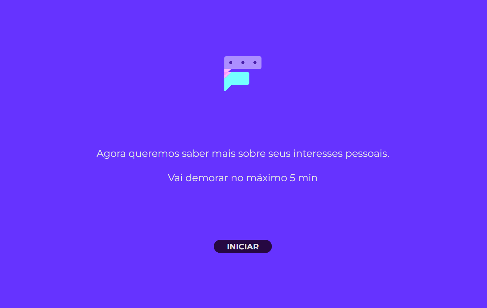

<h1 align="center">Frient Web</h1>
<p align="center">Project carried out during the 10th edition of the Campus Mobile Hackathon</p>

<p align="center">
  <a href="#-about-the-project">About the project</a>&nbsp;&nbsp;&nbsp;|&nbsp;&nbsp;&nbsp;
  <a href="#-layout">Layout</a>&nbsp;&nbsp;&nbsp;|&nbsp;&nbsp;&nbsp;
  <a href="#-technologies">Technologies</a>&nbsp;&nbsp;&nbsp;|&nbsp;&nbsp;&nbsp;
  <a href="#-how-to-install">How to install</a>&nbsp;&nbsp;&nbsp;|&nbsp;&nbsp;&nbsp;
  <a href="#-how-to-contribute">How to contribute</a>&nbsp;&nbsp;&nbsp;|&nbsp;&nbsp;&nbsp;
  <a href="#memo-license">License</a>
</p>

# 📖 About the project
<p>FRIENT aims to create a social network capable of uniting people with the same or different personalities, through a personality test.</p>

# 🔖 Layout

<h1 align="center">
    
</h1>

# 🛠 Technologies

This project was developed with the following technologies:

<h4>Front-end e mobile:</h4>

- [ReactJS](https://pt-br.reactjs.org/)
- [SASS](https://sass-lang.com/)


# 👨‍💻 How to install

```bash
# Clone this repository
$ git clone https://github.com/gabrielvieira1/Frient-Lab/frient-web.git

# Go into the repository folder and install dependencies
$ cd frient-web

# Run
$ yarn install

$ yarn start
```

## 🤔 How to contribute

- Make a fork;
- Create a branck with your feature: `git checkout -b my-feature`;
- Commit changes: `git commit -m 'feat: My new feature'`;
- Make a push to your branch: `git push origin my-feature`.

After merging your receipt request to done, you can delete a branch from yours.

## :memo: License

This project is under the MIT license. See the [LICENSE](LICENSE) for details.

Made with ♥ by Gabriel Vieira :wave: [Get in touch!](https://www.linkedin.com/in/bielvieira/)
